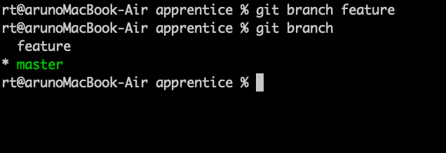
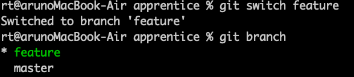
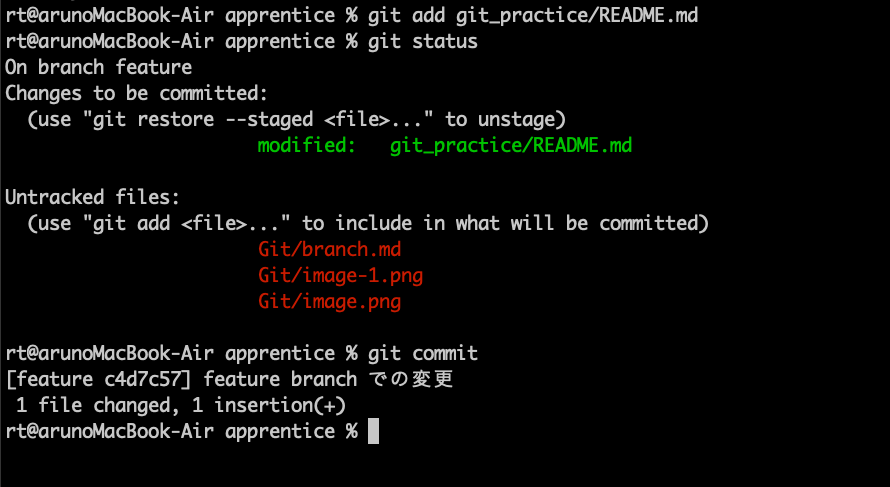
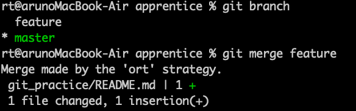
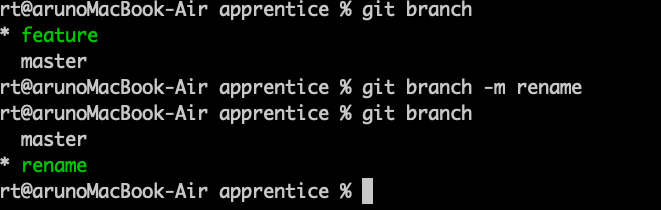
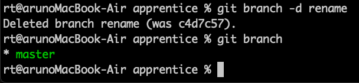

ブランチを利用して開発を進めることができる
Git で管理されているディレクトリに移動してください。

1. ブランチの新規作成
feature という名前のブランチを新規作成してください。

2. ブランチの切り替え
ローカルリポジトリのブランチを feature ブランチに切り替えてください。

3. マージ
feature ブランチでファイルの変更を行い、コミットしてください。そしてローカルリポジトリのブランチを main ブランチに切り替えてください。
次に、feature ブランチの変更を main ブランチに取り込んでください。なお、他のブランチの変更を取り込むことをマージと言います。

4. ブランチの名前の変更
feature ブランチの名前を rename という名前に変更してください。

5. ブランチの削除
rename ブランチを削除してください。

