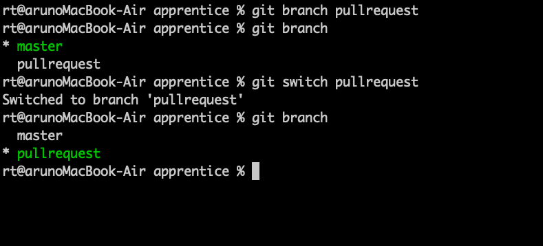
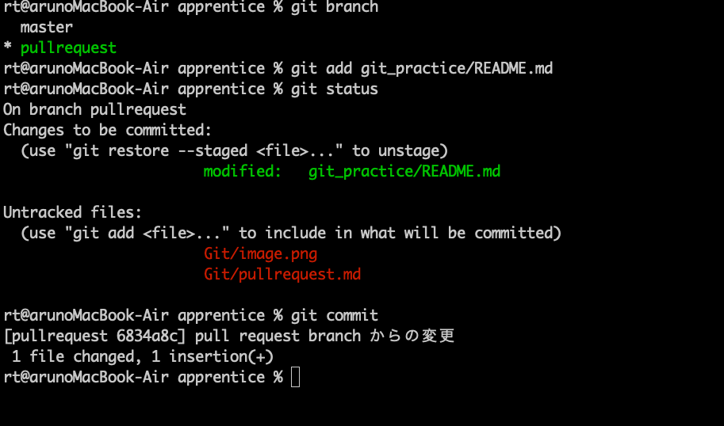
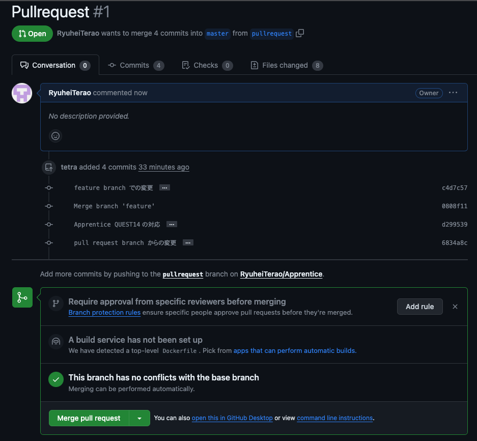
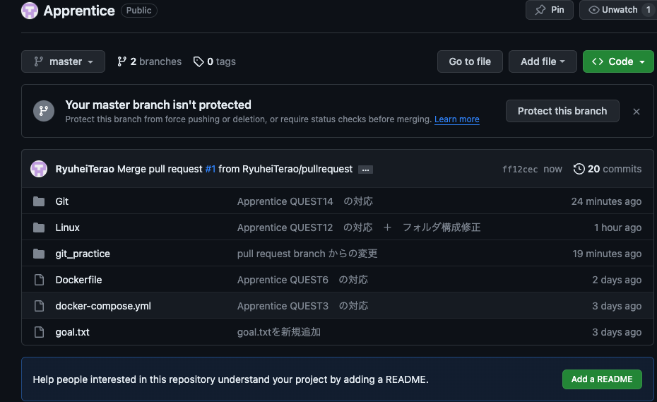
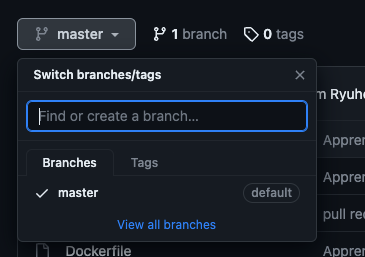
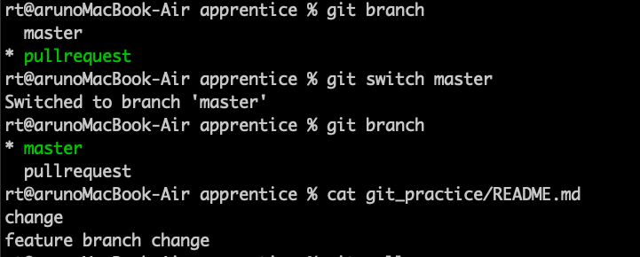
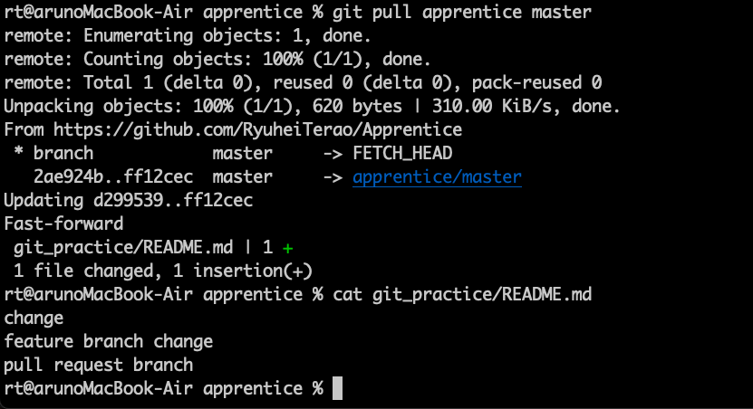

GitHub フローに従って開発を進めることができる
GitHub にプッシュをしたことのあるローカルリポジトリ（自分の PC 上のディレクトリ）に移動してください。

1. プルリクエストとは
プルリクエストは何か、何のためにあるかをプログラミング初心者にわかるように説明してください。

→ プルリクエストは本番環境のデータを更新するときに、更新内容に問題ないか確認してもらうように依頼を出すこと。

2. プルリクエストの作成
以下のことを行い、プルリクエストを作成してください。
ローカル（自分の PC ）で pullrequest ブランチを新規作成し、切り替えてください
任意のファイルに変更を行ってください
変更をコミットしてください
GitHub に pullrequest というブランチ名で変更をプッシュしてください
GitHub を開き、pullrequest ブランチから main ブランチへのプルリクエストを作成してください
変更内容を確認し、問題なければ GitHub 上で変更をマージしてください
GitHub 上の pullrequest ブランチを削除してください

３. ローカルへのリポートリポジトリの変更内容の取り込み
ローカルリポジトリのブランチを main ブランチに切り替えてください。
次に、リモートリポジトリ（GitHub）の main ブランチの内容をローカルリポジトリの main ブランチに取り込んでください。
それができたらローカルリポジトリの pullrequest ブランチを削除してください。
※開発を行う際はここから1に戻り、この1~2のステップを繰り返します

4. GitHub フロー
GitHub フロー の公式リファレンスを一読してください。

その上で、今後の開発は GitHub フローに基づいて行ってください。多くの組織における基本的な開発フローは GitHub フローもしくは GitHub フローをベースにしたものになります。今から GitHub フローに慣れていきましょう。
