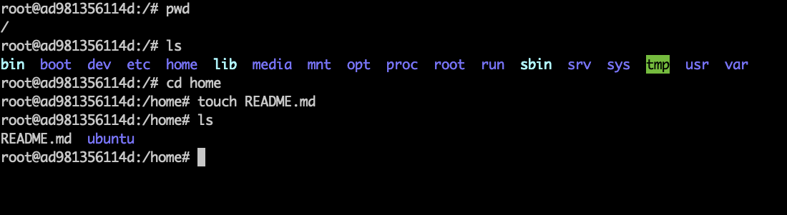

ファイルを操作できる
1. ファイルの中身を出力
/etc/hosts ファイルの中身を出力してください。/etc/hosts ファイルが存在しない場合は、何らかのテキストファイルの中身を出力してください。

2. ファイルの中身をスクロール表示
/etc/hosts ファイルの中身をスクロール式で表示してください。/etc/hosts ファイルが存在しない場合は、何らかのテキストファイルの中身を表示してください。

3. ファイルの作成
ホームディレクトリの直下に、README.md という名前の空ファイル（中身が空のファイル）をコマンドを利用して作成してください。

4. ファイル名の変更
先程作成した README.md ファイルの名前を TMP.md という名前に変更してください。

5. ファイルのコピー
先程作成した TMP.md ファイルをコピーして COPY.md ファイルを作成してください。

6. ファイルの削除
先程作成した TMP.md ファイルを削除してください。

7. シンボリックリンク
作成した README.md に対して、シンボリックリンクを貼ってください。シンボリックリンクのファイル名は README_SYMBOLIC.md としてください。作成後、README.md に対して任意の文章を追記してください。その後、symbolic_file の中身を出力し、追記した内容が README_SYMBOLIC.md にも反映されていることを確認してください。

8. ファイルの検索
ホームディレクトリ以下のファイルに対して、README という文字列が含まれるファイルを全て検索し、出力してください。なお、find コマンドを使用して実現することができます。

9. 検索
~/sample.txt ファイルを作成し、以下の内容を記載してください。
apple
banana
grape
lemon
その上で、sample.txt ファイルから、"a" で始まる単語を検索してください。なお、grep コマンドを使用して実現することができます。
a

