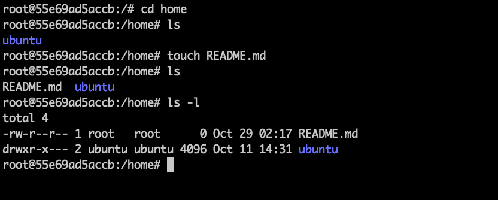
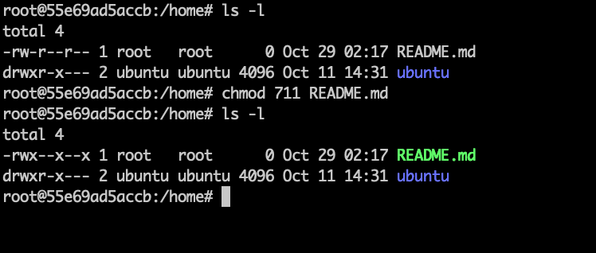
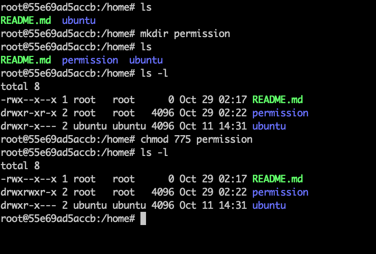
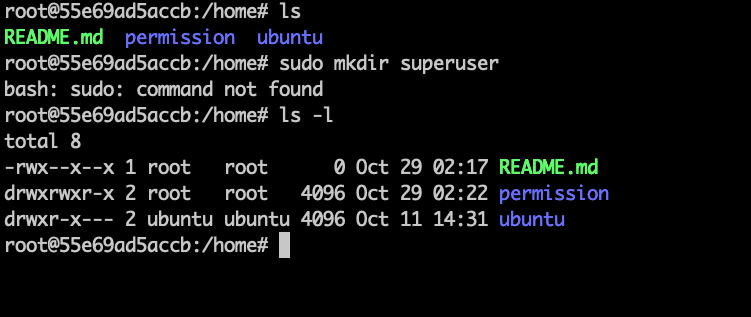

パーミッションを操作できる
1. ファイルのオーナーとグループ
ホームディレクトリの直下に、README.md という名前の空ファイルを作成してください。
その上で、README.md ファイルのオーナーとグループを確認してください。

2. ファイルのパーミッション
README.md ファイルのパーミッションを確認し、誰に何の権限が付与されているかを説明してください。

ルートユーザーに読み取り書き込み権限が付与されている。
グループ(ルート)とその他のユーザーには読み取りの権限のみ付与されている

3. ファイルのパーミッションの設定
README.md ファイルのオーナーに対して、読み取り、書き込み、実行の全ての権限を付与してください。

4. ディレクトリのパーミッションの設定
ホームディレクトリの直下に、permission という名前の空ディレクトリを作成してください。
permission ディレクトリのグループに対して、書き込み権限を付与してください。

5. スーパーユーザー
スーパーユーザーとして、ホームディレクトリの直下に superuser という名前の空ディレクトリを作成してください。
作成後、superuser ディレクトリのオーナーが誰かを確認してください。

すでにルートユーザーであるためsudoが使えないため省略する。

