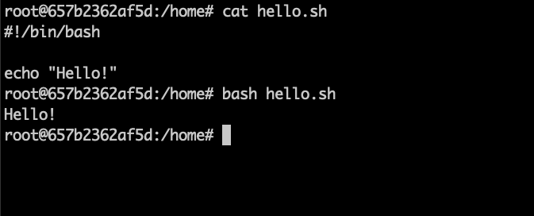
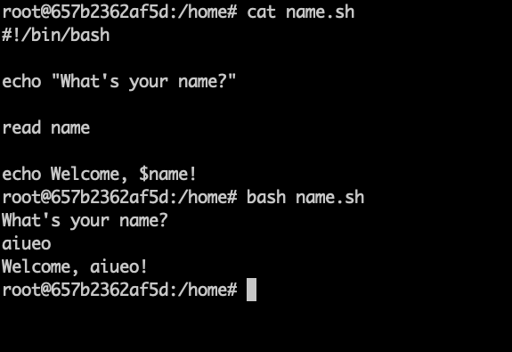
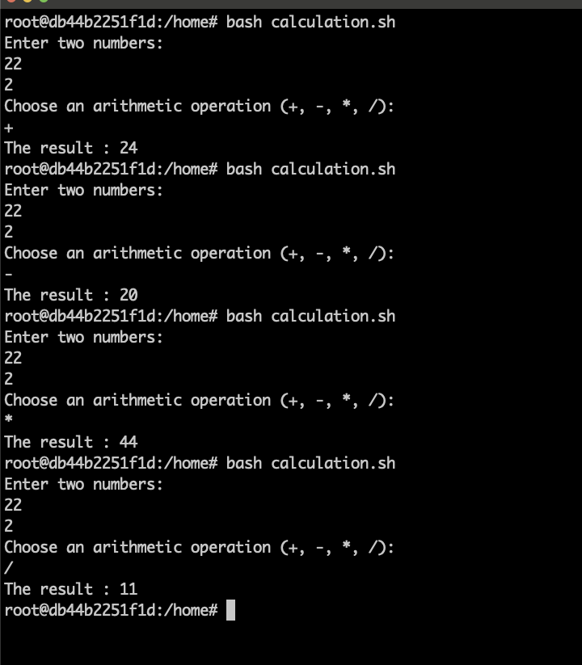
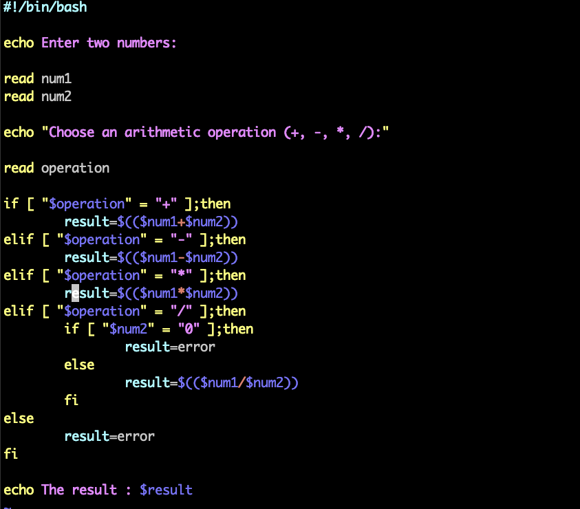
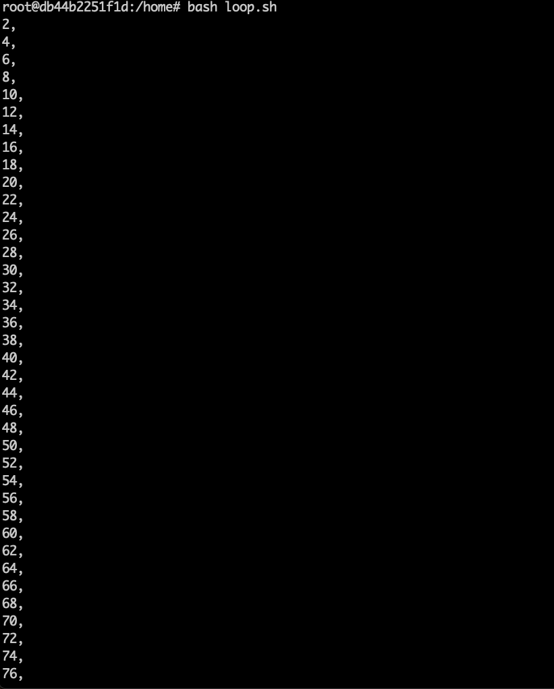
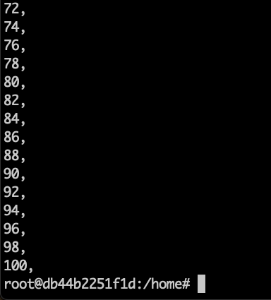
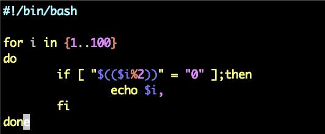

シェルスクリプトを書くことができる
1. Hello
シェルスクリプトのファイルを作成し、「Hello!」と出力してください。
なお、シェルスクリプトを実行する際にはファイルに実行権限が付与されている必要があることに気を付けてください。

2. 標準入力から値を受け取る
シェルスクリプトのファイルに「What's your name?」と出力し、ユーザーに名前の入力を求めます。その後ユーザーが入力した名前に対して、「Welcome, $name!」（$name は入力された名前）と出力する処理を追加してください。

3. 条件分岐
四則演算を行う電卓を作成してください。実行すると以下の挙動になります。

Enter two numbers:
10 # ユーザーが入力
11 # ユーザーが入力
Choose an arithmetic operation (+, -, *, /):
+ # ユーザーが入力
The result:21
なお、割り算の時の割る数が 0 であるケースや、演算子の記号 +, -, *, / が合致しないケースを考慮するかは任意とします。

4. 繰り返し処理
for 文 または while 文を利用して、1~100までのうち、偶数の数字を表示する処理を書いてください。以下の結果が出力されます。

2 4 8 ... 100

