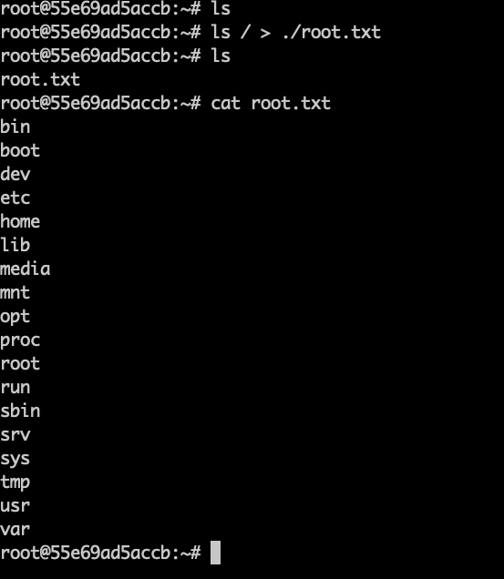
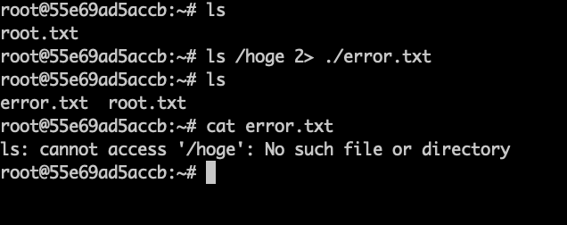
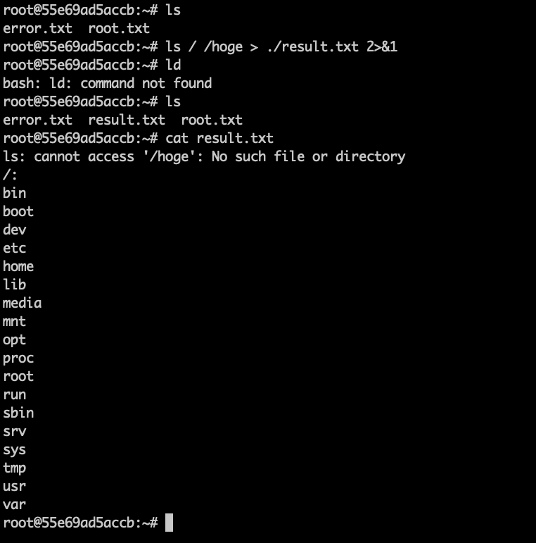
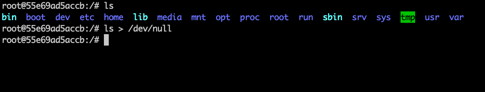
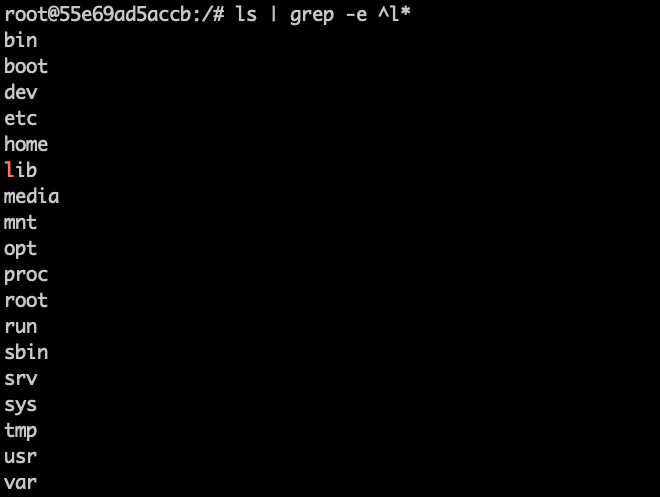
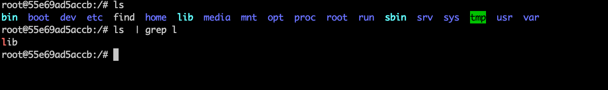

標準入出力を扱える
1. 標準入出力とは
標準入力、標準出力、標準エラー出力について、プログラミング初心者にわかるように説明してください。

■標準入力
キーボードからパソコンに文字を打ち込むこと。
プログラムにデータを与えること。

■標準出力
プログラムから出てくるデータのこと。
ディスプレイなどに表示されるデータ。

■標準エラー出力
標準出力の中でもエラーについてのデータのこと。

2. リダイレクト
リダイレクトを使用して、ルートディレクトリを ls コマンドで出力した結果を、~/root.txt という新規ファイルに保存してください。

3. エラー出力のリダイレクト
コマンドを実行してエラーになった際に、エラー結果を ~/error.txt という新規ファイルに保存してください。エラーを発生させるにはは例えば ls /hoge など、存在しないファイル・ディレクトリを ls コマンドで参照する方法があります。

4. 出力とエラー出力のリダイレクト
ルートディレクトリと存在しないファイルを ls コマンドで一度で参照しようとして( ls / /hoge )、その両方の結果を一度に ~/result.txt という新規ファイルに保存してください。

5. /dev/null とは
/dev/null とは何で、どういう時に使われるものかをプログラミング初心者にわかるように説明してください。

■/dev/nullとは
　/dev/null　は何もないということを表している。
　出力が大量にあって邪魔という時などに/dev/nullで非表示にしたりするときに使用する。

6. /dev/null へのリダイレクト
ルートディレクトリを ls コマンドで参照した結果を、/dev/null にリダイレクトし、何も表示されないことを確認してください。

7. パイプライン
ルートディレクトリを ls コマンドで参照した結果のうち、"l" から始まるものだけを、パイプラインを使用して一回のコマンドで表示してください。

