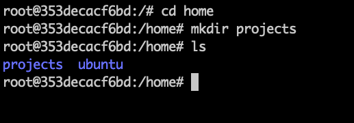

ディレクトリ操作について
ディレクトリを操作できる
Linux にログインしてターミナル上で行ってください。

1. 現在のディレクトリ
自分が現在いるディレクトリを表示してください。

2. ルートディレクトリ
現在のディレクトリから、"/" ディレクトリに移動してください。

3. ホームディレクトリ
現在のディレクトリから、ホームディレクトリに移動してください。

4. 一つ上のディレクトリ
現在のディレクトリから、一つ上の親ディレクトリに移動してください。

5. ディレクトリの内容
現在のディレクトリの内容を表示してください。

6. 隠しファイル
現在のディレクトリの隠しファイルを含む全てのファイルとディレクトリを表示してください。

7. 詳細なリスト形式
"/etc" ディレクトリの内容を、詳細なリスト形式で表示してください。
なおわからない場合は、"man ls" コマンドで ls コマンドの詳細を確認することができます。"List files in the long format" といった説明のあるオプションを付けてください。

8. ディレクトリの作成
ホームディレクトリに移動し、"projects" という名前のディレクトリを作成してください。

9. ディレクトリの削除
作成した "projects" ディレクトリを削除してください。

